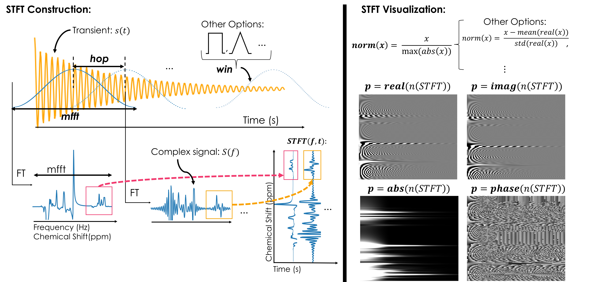
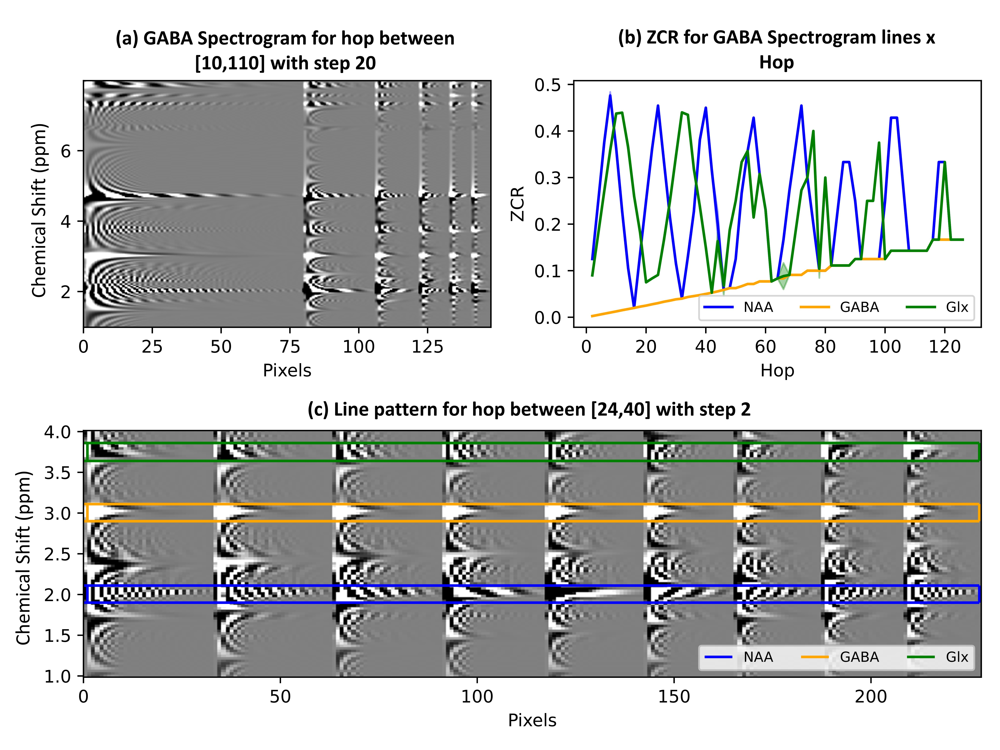
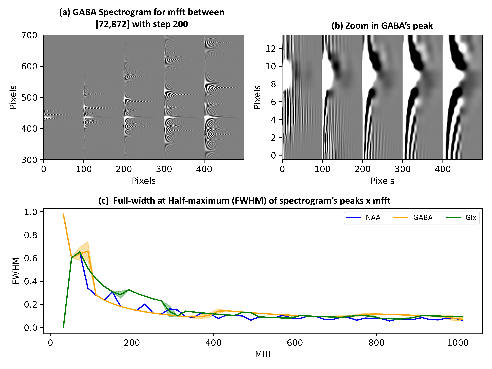

# Understanding Magnetic Resonance Spectroscopy Representation for GABA Quantification via Spectrogram

This repository contains experiments conducted for the undergraduate research project entitled: **Magnetic Resonance Spectroscopy (MRS) for GABA Quantification: Understanding Spectrogram Representation to Improve the Training of a Deep-Learning-Based Reconstruction Model**, carried out at the **Medical Image Computing Lab (MICLab)** of the **Faculty of Electrical and Computer Engineering (FEEC)** with funding from **FAPESP** (project: 2024/01294-2).

Supervisor: Letícia Rittner

Student: Letícia Diniz

Project Abstract: Gamma-Aminobutyric Acid (GABA) is the primary inhibitory neurotransmitter in the nervous system, and deficiencies in GABA levels are associated with psychiatric syndromes, such as depression. Due to its importance, there is an interest in quantifying GABA concentration in vivo. For this purpose, Magnetic Resonance Spectroscopy (MRS) is used, in which multiple GABA transients are acquired and their spectra analyzed. However, this technique requires lengthy acquisitions, which can be uncomfortable for patients. The Deep-Learning model [SpectroVit](https://pubmed.ncbi.nlm.nih.gov/39069027/) was proposed to speed up acquisitions, generating high-quality spectra from the spectrogram of a limited number of GABA transients. The spectrogram is a two-dimensional representation carrying both temporal and frequency information of the original signal and is not commonly used in the MRS context. It is obtained through the Short-Time Fourier Transform (STFT), which employs a windowing technique. This study investigates how the spectrogram representation of GABA transients changes depending on the STFT parameter choices (window size, step, shape, and image normalization) and the original signal characteristics (different noise levels). It also examines how varying the window step affects SpectroVit’s performance. Both qualitative observations and quantitative metrics support the characterization of the GABA spectrogram. This work contributes to understanding this new representation for GABA transients, which serves as the input for SpectroVit, thereby aiding the model's interpretability and clinical acceptance.

## Context

Magnetic resonance spectroscopy signals are acquired in the time domain and analyzed in the frequency domain through the Fourier Transform (FT). In the time domain, they are referred to as transients or FID signals, while in the frequency domain, they are called spectra. Another possible representation is through the Short-Time Fourier Transform (STFT), which converts the signal into a function of two variables: time and frequency. Although not typically used in the context of neurotransmitter GABA quantification, its use was proposed as an input for the GABA spectrum reconstruction model [SpectroVit](https://pubmed.ncbi.nlm.nih.gov/39069027/), and the positive results have sparked interest in this representation.

The STFT is valuable because it contains both frequency and temporal information. Despite being a function in the complex domain, selecting a single component (real part, imaginary part, magnitude, or phase) allows visualization as an image: the horizontal axis represents time, the vertical axis represents frequency, and pixel intensity corresponds to the STFT component amplitude at a given (time, frequency) pair. This enables the use of extensive image processing tools (both classical and AI-based) for analysis.

The STFT construction depends on a window moving over the signal in time, performing the FT at each position (Fig. 1). The parameters include the step (*hop*), window size (*mfft*), and window shape (*win*). For visualization, normalization (*norm*) and the selected component (*p*) are also essential. This work focuses on how varying these parameters affects the visualized STFT image and how signal properties, such as noise levels, manifest in the STFT domain.



Figure 1: Description of STFT construction and visualization parameters.

The documents in this repository contain the characterization of the STFT regarding the noise level of transients, as well as the variation of *hop*, *mfft*, and jointly, *win* and *norm*. For this purpose, simulated GABA-edited transients provided by the [Edited-MRS Reconstruction Challenge](https://sites.google.com/view/edited-mrs-rec-challenge/home) were used.

An additional study in this work focuses on characterizing the performance of [SpectroVit](https://pubmed.ncbi.nlm.nih.gov/39069027/) as a function of hop variation. The repository associated with this study is available [here](https://github.com/lets-diniz/IC_SpectroVit).

Readers interested in the context, data, and further explanations of the work’s methodology are encouraged to read the partial publication of this work: [Abstract Presented at the XXXII UNICAMP Scientific Initiation Congress](https://prp.unicamp.br/inscricao-congresso/resumos/2024P23809A32091O2964.pdf).

**Note:** The term "spectrogram" is typically used to refer to the image obtained from the visualization of the STFT magnitude on a logarithmic scale. However, for consistency with the terminology used in the [SpectroVit](https://pubmed.ncbi.nlm.nih.gov/39069027/) publication, this repository adopts a broader use of the term "spectrogram," understanding the STFT as an image. Since, in general, spectroscopy uses only the real part of the FT to define what is called a spectrum, the term "GABA spectrogram" here refers to the image obtained from the visualization of the real part of the STFT (*p* = real part). The nomenclature presented here is assumed throughout the remainder of this document.

## Repository Description

This repository contains five notebooks detailing the results of the GABA spectrogram characterization:

- [Noise Study](STFT_NoiseStudy.ipynb): Presents the characterization results regarding amplitude noise addition to transients. It describes how this noise type manifests in the spectrogram domain and proposes three methods for estimating noise levels. Two methods involve projecting the spectrogram onto the frequency axis, which also enables peak width estimation. The notebook includes plots showing the evolution of statistical characteristics (mean, median, standard deviation, skewness, and kurtosis) across different spectrogram regions as noise increases.

- [Hop Variation Results](STFT_HopVariation_Results_with_and_without_noise.ipynb): Explores how varying the *hop* affects the temporal resolution and peak appearance (e.g., stripe patterns) in the spectrogram. It also assesses the impact on the frequency resolution of less intense and major peaks. Statistical variations in different spectrogram regions as a function of *hop* are analyzed. Figure 2 summarizes the main *hop* effects.

- [Mfft Variation Results](STFT_MfftVariation_Results_with_and_without_noise.ipynb): Shows how changes in *mfft* affect the spectrogram’s frequency resolution, influencing peak width and length. It also investigates any visual effects on the peaks. Figure 3 highlights the primary effects of varying *mfft*.

- [WinNorm Variation Results](STFT_MfftVariation_Results_with_and_without_noise.ipynb): Details how combinations of *win* and *norm* parameters impact peak width, length, and appearance. It also examines how these variations influence the image’s statistical properties.

- [Hop Variation Considerations for Different Mfft](STFT_HopVariation_Considerations_for_different_mfft_data_without_noise.ipynb): A complementary notebook exploring whether the *hop* variation findings generalize across different *mfft* values.



Figure 2: Description of the main effects of *hop* variation.



Figure 3: Description of the main effects of *mfft* variation.

The results presented in the notebooks mentioned above are both qualitative and quantitative. To generate the quantitative results, three scripts are used:

- [Hop Study](generate_quantitative_dataset_hop_study.py)

- [Mfft Study](generate_quantitative_dataset_mfft_study.py)

- [WinNorm Study](generate_quantitative_dataset_winnorm_study.py)

The usage of these scripts is described in the section [How to generate quantitative results](#how-to-generate-quantitative-results).

In addition to these, the scripts

- [Functions for Noise Study](functions_for_noise_study.py)

- [Functions for Parameter Study](functions_for_param_study.py)

- [Utils](utils.py)

- [Data corruption](data_corruption.py)

contain auxiliary functions used in the generation and analysis of quantitative and qualitative results.

Finally, additional folders contain the original notebooks for generating quantitative results and the initial approach taken for the noise study, which was later replaced by the approach presented in [Noise Study](STFT_NoiseStudy.ipynb) as it seemed more appropriate for spectrogram characterization.

## How to generate quantitative results

To use the scripts for generating quantitative data, you need to run the script, for example:

```yaml
python generate_quantitative_dataset_hop_study.py
```
At the beginning of the execution, the user will be prompted to provide the path to a YAML file containing the information that defines the study to be conducted.

General information:

```yaml
fids:
  qntty: int # number of transients to consider. Default: 100
  path_to_gt_fids: "path to the h5 file containing the transients" # should contain datasets: "ground_truth_fids", "ppm", and "t", with transients of size (2048,2), arrays of ppm and time of size (2048), respectively

name_of_study: "string with the name of the folder to be created to save the resulting files" # default: hop_study

amplitude_noise:
  add_noise: True/False # if True, noise is added to the transients
  noise_config:
    std_base: float # base value for the variance of the normal distribution that configures the noise
    std_var: float # maximum possible variation for the variance of the normal distribution relative to the base value
    nmb_of_transients_to_combine: int # number of noisy transients to be created from an original transient. Default: 160

save_pictures_along_the_way: True/False # if True, produces images of the analysis during script execution
```

Specific information for each type of study, for example, regarding the variation of *hop*:

```yaml
study_parameters:
  param_to_vary: 'hop' # The parameter that will be varied in the study.
  variation_details:
      min: int # Minimum value for the hop
      max: int # Maximum value for the hop
      step: int # Step between hop values
  fixed_params:
      'mfft': int # mfft value to be used. Default: 512
      'win': string # 'hann', 'rect', or 'flat'. Default: 'hann'. If other options are desired, the script must be modified.
      'norm': string # 'abs', 'm1p1', 'minmax', or 'zscore'. Default: 'abs'. If other options are desired, the script must be modified.
```

For the winnorm study, the key 'variation_details' should contain two lists: one for the window types (win) and one for the normalization types (norm). Example:

```yaml
study_parameters:
  param_to_vary: 'winnorm'
  variation_details:
      win:
        - 'hann'
        - 'rect'
        - 'flat'
      norm:
        - 'abs'
        - 'm1p1'
        - 'minmax'
        - 'zscore'
  fixed_params:
      'hop': 8
      'mfft': 512
```

It is also possible to perform a statistical analysis regarding the variation of the parameters. For this, it is necessary to indicate absolute values that constitute limits for the selection of sections of the image:

```yaml
stats_analysis:
  perform_stats_analysis: True/False # If False, the statistical analysis is not performed
  segmentation_values: list of floats # List of the considered limits
  save_pictures: True/False # If True, saves images of the analysis during script execution
```

For further clarification, it is suggested to read the notebook: [Hop Variation Results](STFT_HopVariation_Results_with_and_without_noise.ipynb).

Examples of YAML files and quantitative datasets are available in this repository.

## Credits

- This study used data obtained from the [Edited-MRS Reconstruction Challenge](https://sites.google.com/view/edited-mrs-rec-challenge/home). 

- The Data Augmentation script was adapted from the [Edited-MRS Reconstruction Challenge repository](https://github.com/rmsouza01/Edited-MRS-challenge).
