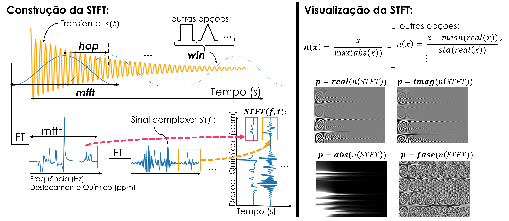
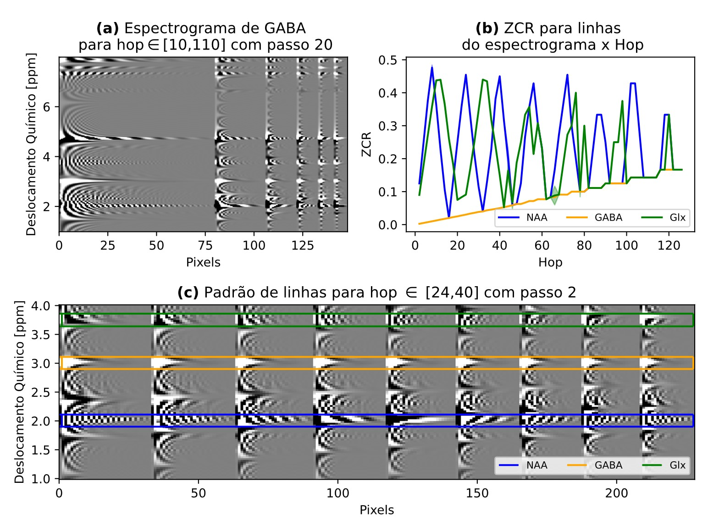
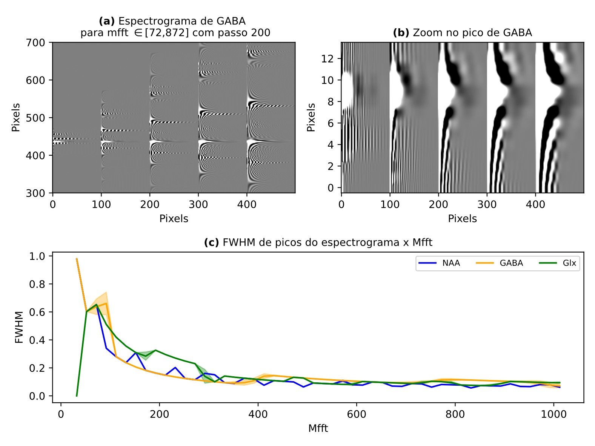

# Compreendendo a Representação de Espectroscopia por Ressonância Magnética para Quantificação de GABA via Espectrograma

Este repositório contém experimentos realizados para o projeto de iniciação científica entitulado: **Espectroscopia por ressonância magnética (MRS) para quantificação GABA: compreendendo a representação por espectrograma para aperfeiçoar o treinamento de um modelo de reconstrução baseado em Deep-Learning**, realizado no laboratório **Medical Image Computing Lab (MICLab)** da **Faculdade de Engenharia Elétrica e de Computação (FEEC)** com financiamento da **FAPESP** (projeto: 2024/01294-2).

Orientadora: Letícia Rittner

Orientanda: Letícia Diniz

Resumo do projeto: O Ácido Gama-aminobutírico (GABA) é o principal neurotransmissor inibitório do sistema nervoso e deficiências nos níveis de GABA estão associadas a síndromes psiquiátricas, tais como a depressão. Dada sua importância, existe interesse em quantificar a concentração de GABA *in vivo*. Para tal, utiliza-se a técnica de espectroscopia por ressonância magnética (MRS), na qual múltiplos transientes de GABA são adquiridos e seus espectros analisados. O problema dessa técnica é que ela exige aquisições demoradas e desconfortáveis para o paciente. O modelo de *Deep-Learning* [SpectroVit](https://pubmed.ncbi.nlm.nih.gov/39069027/) foi proposto com o intuito de acelerar as aquisições, gerando espectros de alta qualidade a partir do espectrograma de uma quantidade limitada de transientes de GABA. O espectrograma é uma representação bidimensional que carrega informações temporais e frequenciais sobre o sinal de origem, e não é normalmente usado no contexto de MRS. O espectrograma é obtido através da Transformada de Fourier de Curto Tempo (STFT), a qual utiliza uma técnica de janelamento do sinal. Este estudo se propôs a investigar a representação por espectrograma de transientes de GABA, visando entender como tal representação se altera dependendo das escolhas de parâmetros da STFT (tamanho, passo e formato de janela e normalização da imagem) e da característica do sinal original (diferentes níveis de ruído). Também investigou-se como a variação do passo de janela afeta a performance do SpectroVit. Para a caracterização do espectrograma de GABA considera-se observações qualitativas apoiadas de métricas quantitativas. Este trabalho contribui para o entendimento dessa nova representação para transientes de GABA que é o objeto de entrada do SpectroVit, contribuindo assim para a explicabilidade do modelo e aceitação em meio clínico.

## Contexto

Sinais de espectroscopia por ressonância magnétrica são adquiridos no domínio do tempo e analisados no domínio da frequência através da Transformada de Fourier (FT). Quando no domínio do tempo, refere-se a transientes ou sinais FID, no domínio da frequência refere-se a espectros. Uma outra representação possível para tais sinais é a representação pela Transformada de Fourier de Curto Tempo (STFT), a qual transforma o sinal em uma função de duas variáveis: o tempo e a frequência. Essa representação, no entanto, não é muito usual no contexto de espectroscopia para quantificação do neurotransmissor GABA. Apesar disso, seu uso foi proposto como objeto de entrada de um modelo de reconstrução de espectro de GABA - [SpectroVit](https://pubmed.ncbi.nlm.nih.gov/39069027/) - e os resultados positivos geraram interesse nesse tipo de representação. 

A STFT é interessante, pois ela carrega informações frequenciais e temporais de um sinal. Além disso, apesar de ser uma função no domínio dos números complexos, quando apenas uma componente é selecionada (parte real, parte imaginária, magnitude ou fase), pode-se visualizar a STFT como uma imagem que contém na direção horizontal o eixo do tempo, na direção vertical o eixo das frequências, e a intensidade dos pixels correspondendo a amplitude da componente da STFT para um par (instante,frequência). Ao tratar-se da STFT como uma imagem, pode-se utilizar das vastas ferramentas de tratamento de imagens (clássicas e baseadas em IA) para extrair informações da mesma.

A construção da STFT depende de uma janela que percorre o sinal no tempo e em cada posição realiza a FT do sinal englobado (Fig. 1). O passo, tamanho e formato da janela são parâmetros dessa função, e referidos neste trabalho como *hop*,*mfft* e *win*, respectivamente. Além disso, para a visualização da STFT a normalização da função (*norm*) e a componente visualizada (*p*) também são parâmetros importantes. Neste trabalho, visto o interesse na utilização da STFT para representar sinais FID de GABA, busca-se caracterizar como a variação dos parâmetros da STFT afetam a imagem visualizada. Além disso, busca-se caracterizar como propriedades do sinal, como o nível de ruído, se manifestam no domínio da STFT.



Figura 1: Descrição dos parâmetros de construção e de visualização da STFT.

Nos documentos deste repositório encontra-se a caracterização da STFT com relação ao nível de ruído dos transientes, e da variação do *hop*, *mfft* e, conjuntamente, de *win* e *norm*. Para tal, utilizou-se transientes GABA-editados simulados disponibilizados pelo desafio [Edited-MRS Reconstruction Challenge](https://sites.google.com/view/edited-mrs-rec-challenge/home).

Ao leitor interessado no contexto, dados e maiores explicações da metodologia do trabalho sugere-se leitura da publicação parcial do trabalho: [Resumo Apresentado no XXXII Congresso de Iniciação Científica da UNICAMP](https://prp.unicamp.br/inscricao-congresso/resumos/2024P23809A32091O2964.pdf)

**Observação:** Normalmente, utiliza-se o termo "espectrograma" para referir-se a imagem obtida da visualização da magnitude da STFT em escala logarítmica. No entanto, por coerência com a terminologia utilizada na publicação do [SpectroVit](https://pubmed.ncbi.nlm.nih.gov/39069027/), neste repositório refere-se a "espectrograma" de modo mais amplo, usando o termo como o entendimento da STFT como uma imagem. Como, no geral, em espectroscopia utiliza-se apenas a parte real da FT para definir o que se chama de espectro, aqui o termo "espectrograma de GABA" refere-se a imagem obtida da visualização da parte real da STFT (*p* = parte real). No restante deste documento, assume-se a nomenclatura aqui apresentada.

## Descrição do Repositório

Este repositório contém cinco notebooks descrevendo os resultados obtidos na caracterização do espectrograma de GABA:

- [Noise Study](STFT_NoiseStudy.ipynb): Contém os resultados da caracterização do espectrograma com relação a adição de ruído de amplitude aos transientes. Neste, descreve-se como esse tipo de ruído se manifesta no domínio do espectrograma e propõe-se três métodos para estimar o nível de ruído nesse novo domínio. Dois dentre os três métodos envolvem o uso de uma projeção do espectrograma na frequência, projeções essas que possuem características interessantes e que permitem, além da estimação do ruído, a estimação da largura dos picos do espectrograma. Neste documento, encontra-se ainda gráficos mostrando a evolução de características estatísticas de diferentes regiões do espectrograma em função do nível de ruído adicionado aos transientes. Como características estatísticas, considera-se: média, mediana, desvio-padrão, skewness e kurtosis.

- [Hop Variation Results](STFT_HopVariation_Results_with_and_without_noise.ipynb): Contém os resultados da caracterização do espectrograma com relação a variação do *hop*. Neste, descreve-se como o *hop* afeta a resolução temporal da imagem e a aparência (listras) dos picos. Avalia-se ainda o impacto desse parâmetro na resolução frequencial dos picos menos intensos da imagem e dos picos mais importantes. Como estudo complementar, observa-se ainda como características estatísticas de diferentes regiões do espectrograma variam em função do *hop*. A Figura 2 apresenta um resumo dos principais efeitos do *hop*.

- [Mfft Variation Results](STFT_MfftVariation_Results_with_and_without_noise.ipynb): Contém os resultados da caracterização do espectrograma com relação a variação da *mfft*. Neste, descreve-se como a *mfft* afeta a resolução frequencial da imagem, impactando a largura e comprimento dos picos. Avalia-se ainda se esse parâmetro afeta a aparência dos picos. A Figura 3 apresenta um resumo dos principais efeitos da *mfft*.


- [WinNorm Variation Results](STFT_MfftVariation_Results_with_and_without_noise.ipynb): Contém os resultados da caracterização do espectrograma com relação a variação de *win* e *norm*. Neste, descreve-se como a combinação de tais parâmetros afeta a largura, comprimento e aparência dos picos. Também investiga-se o efeito da variação de tais parâmetros em características estatísitcas da imagem.


- [Hop Variation Considerations for Different Mfft](STFT_HopVariation_Considerations_for_different_mfft_data_without_noise.ipynb): Notebook complementar. Neste notebook, busca-se compreender se os resultados obtidos no estudo individual do *hop* se gerneralizam para valores diferentes de *mfft*.




Figura 2: Descrição principais efeitos da variação do *hop*.



Figura 3: Descrição principais efeitos da variação da *mfft*.

Os resultados apresentados nos notebooks mencionados acima são qualitativos e quantitativos. Para a geração dos resultados quantitativos, três scripts são utilizados:

- [Hop Study](generate_quantitative_dataset_hop_study.py)

- [Mfft Study](generate_quantitative_dataset_mfft_study.py)

- [WinNorm Study](generate_quantitative_dataset_winnorm_study.py)

A forma de utilização de tais scripts está descrita na Seção [Como gerar resultados quantitativos](#como-gerar-resultados-quantitativos).

Além desses, os scripts 

- [Functions for Noise Study](functions_for_noise_study.py)

- [Functions for Parameter Study](functions_for_param_study.py)

- [Utils](utils.py)

- [Data corruption](data_corruption.py)

contém funções auxiliares utilizadas na geração e análise de resultados quantitativos e qualitativos.

Finalmente, pastas adicionais contém notebooks originais para a geração de resultados quantitativos e a abordagem inicial realizada para o estudo do ruído, a qual foi substituída pela abordagem presente em  por essa parecer mais pertinente para a caracterização do espectrograma.

## Como gerar resultados quantitativos

Para utilização dos scripts de geração de dados quantitativos, é preciso executar o script, por exemplo:

```yaml
python generate_quantitative_dataset_hop_study.py
```
No início da execução, será requisitado ao usuário de indicar o caminho para um arquivo YAML contendo as informações que definem o estudo a ser realizado.

Informações gerais:

```yaml
fids:
  qntty: int #quantidade de transients a considerar. Default: 100
  path_to_gt_fids: "caminho para arquivo h5 contendo os transientes" #deve conter datasets: "ground_truth_fids", "ppm" e "t" contendo transientes de tamanho (2048,2), arrays de ppm e tempo de tamanho (2048), respectivamente

name_of_study: "string com o nome da pasta a ser criada para salvar os arquivos resultantes" #default: hop_study

amplitude_noise:
  add_noise: True/False #se True adiciona ruído aos transientes
  noise_config:
    std_base: float #valor base para variância da distribuição normal que configura o ruído
    std_var: float #variação possível máxima para variância da distribuição normal com relação ao valor de base
    nmb_of_transients_to_combine: int #quantidade de transientes ruídosos a serem criados a partir de um transiente original. Default: 160

save_pictures_along_the_way: True/False #se True, produz imagens da análise durante a execução do script
```
Informações particulares a cada tipo de estudo, para a variação do *hop*, por exemplo:

```yaml
study_parameters:
  param_to_vary: 'hop'
  variation_details:
      min: int #valor mínimo do hop
      max: int #valor máximo do hop
      step: int #passo entre valores de hop
  fixed_params:
      'mfft': int #valor da mfft a ser usado. Default: 512
      'win': string 'hann', 'rect' ou 'flat' #tipo de janela. Default: 'hann'. Caso outras opções sejam desejadas é preciso alterar o script.
      'norm': string 'abs', 'm1p1', 'minmax' ou 'zscore' #tipo de norma. Default: 'abs'. Caso outras opções sejam desejadas é preciso alterar o script.
```

Para o caso do estudo da variação de winnorm, a key 'variation_details' deve conter as keys 'win' e 'norm', cada uma contendo uma lista de tipos de janelas e normas a serem utilizadas. Por exemplo:


```yaml
study_parameters:
  param_to_vary: 'winnorm'
  variation_details:
      win:
        - 'hann'
        - 'rect'
        - 'flat'
      norm:
        - 'abs'
        - 'm1p1'
        - 'minmax'
        - 'zscore'
  fixed_params:
      'hop': 8
      'mfft': 512
```

Também é possível realizar uma análise estatística com relação a variação dos parâmetros. Para tal é necessário indicar valores absolutos que constituem limites para a seleção de trechos da imagem:

```yaml
stats_analysis:
  perform_stats_analysis: True/False #se False, análise estatística não é realizada
  segmentation_values: lista de floats #lista com os limites considerados
  save_pictures: True/False #se True, salva imagens da análise durante execução do script
```

Para maiores esclarecimentos, sugere-se a leitura do notebook: [Hop Variation Results](STFT_HopVariation_Results_with_and_without_noise.ipynb).

Exemplos de arquivos YAML e de datasets quantitativos estão disponibilizados neste repositório. 